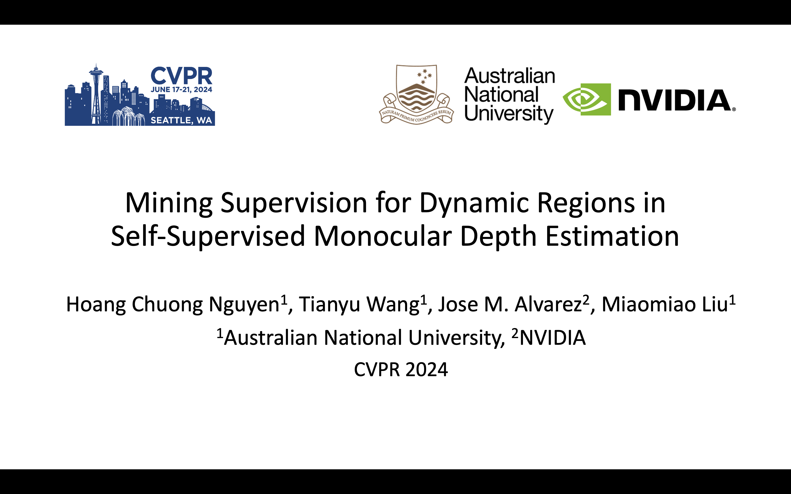
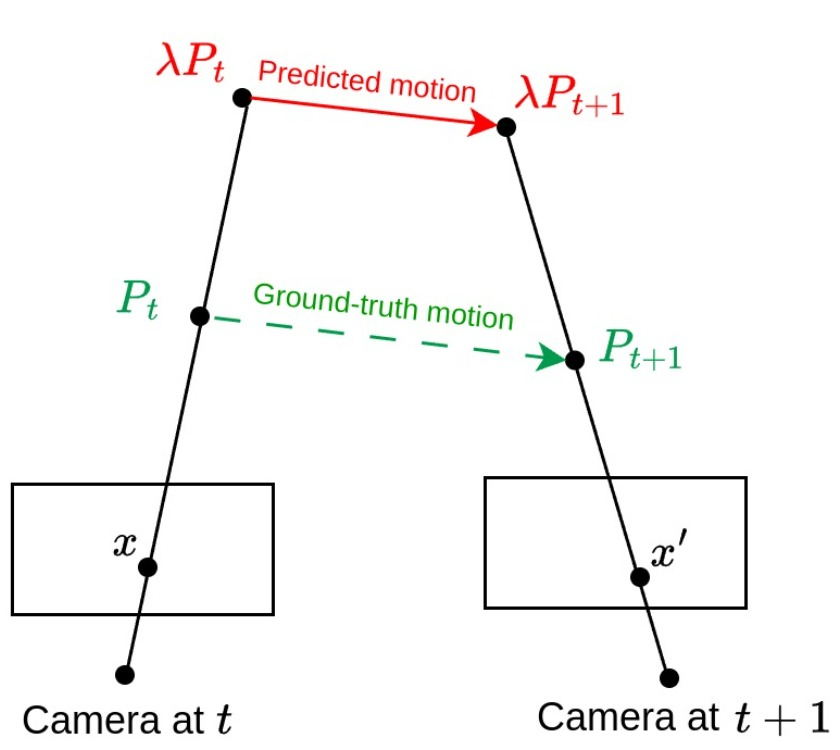

Hoang Chuong Nguyen, Tianyu Wang, [Jose M. Alvarez](https://alvarezlopezjosem.github.io/), [Miaomiao Liu](https://users.cecs.anu.edu.au/~mliu/) - CVPR 2024

\[[Link to paper](https://openaccess.thecvf.com/content/CVPR2024/html/Nguyen_Mining_Supervision_for_Dynamic_Regions_in_Self-Supervised_Monocular_Depth_Estimation_CVPR_2024_paper.html)\]

We propose a framework to address this the depth scale ambiguity issue in dynamic region and mine reliable supervision for learning depth in dynamic region. Our solution is:

- ✅ **Scene Decomposition**: Decompose the scene into static regions and individual moving objects, whose depths are estimated independently.
- ✅ **Depth Scale Alignment (DSA) module**: Introduce a novel DSA module to solve the scale ambiguity among each dynamic object and the static background.
- ✅ **Pseudo Depth Label**: Use the scale-consistent depth produced by the DSA module as supervision to train a depth network. 

<p align="center">
  <a
href="https://www.youtube.com/watch?v=E4jPf_wCQvk&t=160s">
  
  </a>
</p>

## Overview

There exist different pair of object depth and motion that could satisfy the photometric constraint. However, it is difficult to determinine which is the correct. This is the root of the scale ambiguity issue in dynamic region. 

<p align="center">
  
</p>

To address this issue, we propose the following framework
<p align="center">
  
</p>

* Start with an unsupervised depth estimation approach for static region.
* Employ an object depth network to estimate depth of moving objects.
* For each moving object, the DSA module predicts a scalar to align the object depth scale to the scale of the static region.
* Depth maps after the alignment are used as pseudo labels to train a final depth network.

#### Depth Scale Alignment module (DSA)
* **Goal** : (1) Align the scale of static and dynamic regions and (2) Extract scale-consistent pseudo depth labels.
* **Training** : Predict a scalar $\beta^o$ to eliminate the depth scale difference of individual static objects.
$$ L_{scale} = \sum{| \beta^o \mathbf{D}^o_r - \mathbf{M}_r^o \odot \mathbf{D}_r^{scene} | } $$
* **Inference** : For each dynamic object, predict a scale $\beta^o$ to solve its depth scale ambiguity issue. The pseudo depth label is then constructed from the scaled object depth and depth of the static background. 

## ✏️ 📄 Citation

If you find our work useful or interesting, please cite our paper:

```latex
@inproceedings{nguyen2024mining,
  title={Mining Supervision for Dynamic Regions in Self-Supervised Monocular Depth Estimation},
  author={Nguyen, Hoang Chuong and Wang, Tianyu and Alvarez, Jose M and Liu, Miaomiao},
  booktitle={Proceedings of the IEEE/CVF Conference on Computer Vision and Pattern Recognition},
  pages={10446--10455},
  year={2024}
}
```

## 📈 Results


This github page template template is from [ManyDepth](https://github.com/nianticlabs/manydepth/blob/master/README.md).
